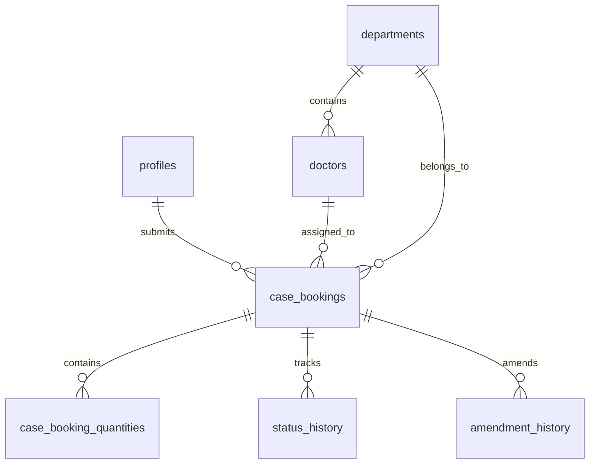

# TM Case Booking Application Architecture

## Table of Contents

1. [Application Overview](#application-overview)
2. [Technical Stack](#technical-stack)
3. [Project Structure](#project-structure)
4. [Database Schema](#database-schema)
5. [Component Architecture](#component-architecture)
6. [Service Layer](#service-layer)
7. [Authentication & Authorization](#authentication--authorization)
8. [Real-time System](#real-time-system)
9. [State Management](#state-management)
10. [Business Logic & Workflows](#business-logic--workflows)
11. [Email & Notification System](#email--notification-system)
12. [File Management & Attachments](#file-management--attachments)
13. [Testing Framework](#testing-framework)
14. [Deployment & Configuration](#deployment--configuration)
15. [Performance & Optimization](#performance--optimization)

---

## Application Overview

**TM Case Booking** is a comprehensive medical case booking and management system built for Transmedic. The application manages surgical case bookings, equipment tracking, user management, and workflow automation across multiple countries and hospitals.

### Core Features

- **Case Booking Management**: Create, track, and manage surgical case bookings
- **Multi-country Support**: Supports operations across different countries with localized data
- **Role-based Access Control**: Granular permission system for different user roles
- **Real-time Updates**: Live data synchronization across all connected clients
- **Status Workflow**: Automated case status progression from booking to completion
- **Document Management**: File attachments and document tracking per case
- **Email Notifications**: Automated email alerts for status changes and updates
- **Audit Logging**: Comprehensive activity tracking and audit trails
- **Mobile Responsive**: Optimized for both desktop and mobile devices

### Version Information

- **Current Version**: 1.3.3
- **Cache Version**: 1.0.10
- **Framework**: React 18.2.0 with TypeScript
- **Backend**: Supabase (PostgreSQL + real-time subscriptions)

---

## Technical Stack

### Frontend

- **React**: 18.2.0 - Core UI framework
- **TypeScript**: 4.7.4 - Type safety and development experience
- **React Query**: 5.87.4 - Server state management and caching
- **React Error Boundary**: Error handling and fault tolerance
- **React DatePicker**: Date selection components
- **CSS**: Custom CSS with component-scoped styles

### Backend & Database

- **Supabase**: Backend-as-a-Service providing:
  - PostgreSQL database
  - Real-time subscriptions
  - Authentication
  - Row Level Security (RLS)
  - File storage
- **bcryptjs**: Password hashing and security

### Development & Testing

- **Playwright**: End-to-end testing framework
- **ESLint**: Code linting and quality
- **Prettier**: Code formatting
- **Jest**: Unit testing
- **Testing Library**: Component testing utilities

### Deployment

- **Vercel**: Primary deployment platform
- **GitHub Pages**: Alternative deployment option
- **Docker**: Containerization support

---

## Project Structure

```
src/
├── components/           # React components
│   ├── CaseCard/        # Case detail components
│   ├── CasesList/       # Case listing components
│   ├── EditSets/        # Equipment management
│   ├── ErrorBoundary/   # Error handling
│   └── common/          # Shared components
├── services/            # Business logic and API calls
├── hooks/               # Custom React hooks
├── utils/               # Utility functions
├── types/               # TypeScript type definitions
├── constants/           # Application constants
├── contexts/            # React contexts
├── lib/                 # External library configurations
├── assets/              # Styles and static assets
└── data/                # Static data and configurations

e2e/                     # End-to-end tests
├── tests/              # Test specifications
└── utils/              # Test utilities

public/                  # Static assets
config/                  # Build configuration
```

---

## Database Schema

The application uses a comprehensive PostgreSQL schema through Supabase with the following key tables:

### Core Tables

#### `profiles` - User Management
- **Primary Key**: `id` (UUID)
- **Fields**: username, name, email, role, password_hash, countries, departments, selected_country
- **Features**: Multi-country access, role-based permissions, temporary password support

#### `case_bookings` - Main Case Data
- **Primary Key**: `id` (UUID)
- **Key Fields**: 
  - `case_reference_number` - Unique case identifier
  - `hospital`, `department`, `country` - Location data
  - `doctor_id`, `doctor_name` - Surgeon information
  - `procedure_type`, `procedure_name` - Surgery details
  - `date_of_surgery`, `time_of_procedure` - Scheduling
  - `status` - Current workflow status
  - `submitted_by`, `processed_by` - User tracking
  - `surgery_set_selection`, `implant_box` - Equipment arrays
  - `attachments` - File references

#### `case_booking_quantities` - Equipment Quantities
- **Purpose**: Track quantities of equipment items per case
- **Fields**: case_booking_id, item_type, item_name, quantity

#### `permissions` - Role-based Access Control
- **Fields**: role, resource, action, allowed
- **Purpose**: Granular permission control

### Supporting Tables

#### Medical Data
- `doctors` - Surgeon information by country/department
- `departments` - Hospital departments per country
- `surgery_sets` - Available surgical equipment sets
- `implant_boxes` - Available implant containers

#### System Tables
- `code_tables` - Centralized lookup data (countries, hospitals, statuses)
- `system_settings` - Application configuration
- `audit_logs` - Activity tracking
- `notifications` - User notifications

#### Workflow Tables
- `status_history` - Case status change tracking
- `amendment_history` - Case modification history
- `email_notification_rules` - Email automation rules

### Relationships



---

## Component Architecture

### Component Hierarchy

```
App (Root)
├── ErrorBoundary
├── QueryClientProvider
├── SoundProvider
├── NotificationProvider
├── ToastProvider
├── RealtimeProvider
└── AppContent
    ├── Header (Desktop)
    ├── MobileHeader
    ├── Navigation
    ├── Main Content
    │   ├── CaseBookingForm
    │   ├── CasesList
    │   │   ├── CaseCard
    │   │   │   ├── CaseHeader
    │   │   │   ├── CaseDetails
    │   │   │   ├── StatusWorkflow
    │   │   │   ├── AmendmentForm
    │   │   │   └── AttachmentManager
    │   │   └── CasesFilter
    │   ├── ProcessOrderPage
    │   ├── BookingCalendar
    │   ├── EditSets
    │   ├── UserManagement
    │   ├── Reports
    │   └── Admin Components
    ├── Footer
    └── MobileNavigation
```

### Key Components

#### `App.tsx` - Application Root
- **Purpose**: Main application orchestrator
- **Responsibilities**:
  - User session management
  - Version checking and cache management
  - Page routing and navigation
  - Global event handling
  - Maintenance mode control

#### `CaseBookingForm` - New Case Creation
- **Purpose**: Form for creating new surgical case bookings
- **Features**:
  - Multi-step form validation
  - Dynamic equipment selection based on procedure type
  - Real-time reference number generation
  - Country/department filtering

#### `CasesList` - Case Management Dashboard
- **Purpose**: Display and manage all case bookings
- **Features**:
  - Real-time case updates
  - Advanced filtering and search
  - Bulk operations
  - Status workflow management

#### `CaseCard` - Individual Case Display
- **Purpose**: Detailed view and editing of single cases
- **Subcomponents**:
  - `CaseHeader` - Case identification and key info
  - `CaseDetails` - Comprehensive case information
  - `StatusWorkflow` - Status progression controls
  - `AmendmentForm` - Case modification interface
  - `AttachmentManager` - File upload and management

#### `EditSets` - Equipment Management
- **Purpose**: Manage doctors, procedure types, and equipment sets
- **Features**:
  - Drag-and-drop interface
  - Real-time updates
  - Bulk editing capabilities
  - Country-specific data management

### Component Design Patterns

#### Error Boundaries
- **Implementation**: Custom error boundaries for fault tolerance
- **Scope**: Component-level error isolation
- **Recovery**: Graceful degradation and user feedback

#### Lazy Loading
- **Usage**: Dynamic imports for large components
- **Benefits**: Reduced initial bundle size
- **Implementation**: `React.lazy()` and `Suspense`

#### Compound Components
- **Pattern**: Components designed to work together (e.g., CaseCard subcomponents)
- **Benefits**: Flexibility and maintainability
- **Example**: CaseCard with interchangeable subcomponents

---

## Service Layer

### Service Architecture

The service layer provides a clean abstraction between components and data sources, with specific services for different domains:

#### `supabaseService.ts` - Core Database Operations
- **Purpose**: Primary interface to Supabase database
- **Methods**: CRUD operations for cases, users, and reference data
- **Features**: Error handling, retry logic, field mapping

#### `realtimeCaseService.ts` - Live Data Management
- **Purpose**: Real-time case data operations
- **Features**:
  - Real-time subscriptions
  - Optimistic updates
  - Conflict resolution
  - Performance monitoring

#### `emailNotificationProcessor.ts` - Email Automation
- **Purpose**: Process and send automated email notifications
- **Features**:
  - Template-based emails
  - Rule-based triggering
  - Status change notifications
  - Bulk email operations

#### `userService.ts` - Authentication & User Management
- **Purpose**: User authentication and profile management
- **Features**:
  - Session management
  - Password security
  - Role-based access
  - Multi-country user support

#### Service Integration

```typescript
// Example service usage pattern
const caseService = {
  async createCase(data: CaseBooking): Promise<CaseBooking> {
    // Validation
    await validateCaseData(data);
    
    // Database operation
    const savedCase = await supabaseService.createCase(data);
    
    // Real-time notification
    await realtimeCaseService.broadcastUpdate(savedCase);
    
    // Email notifications
    await emailNotificationProcessor.processCaseCreated(savedCase);
    
    return savedCase;
  }
};
```

### Error Handling Strategy

#### `ErrorHandler` Utility
- **Purpose**: Centralized error handling and recovery
- **Features**:
  - Automatic retries with exponential backoff
  - User-friendly error messages
  - Toast and notification integration
  - Detailed logging

#### Service-Level Error Handling
- **Network Errors**: Automatic retry with backoff
- **Validation Errors**: User feedback with specific field errors
- **Permission Errors**: Graceful degradation and access denial messages
- **System Errors**: Fallback to cached data where possible

---

## Authentication & Authorization

### Authentication Flow

#### Login Process
1. **User Input**: Username/password or SSO
2. **Validation**: Credential verification against Supabase Auth
3. **Session Creation**: JWT token generation
4. **Profile Loading**: User profile and permissions retrieval
5. **Country Selection**: Multi-country users select active country
6. **Permission Cache**: Role permissions loaded and cached

#### Session Management
- **Storage**: Supabase handles JWT storage and refresh
- **Validation**: Periodic session validation
- **Concurrent Session Control**: Prevent multiple active sessions
- **Automatic Logout**: Inactivity and maintenance mode handling

### Authorization System

#### Permission Model
```typescript
interface Permission {
  id: string;
  roleId: string;    // admin, manager, operations-manager, etc.
  actionId: string;  // create-case, view-reports, etc.
  allowed: boolean;
  resource: string;  // cases, users, system-settings
}
```

#### Role-Based Access Control (RBAC)

##### Roles
- **Admin**: Full system access, user management, system configuration
- **Manager**: Case management, reports, limited user management
- **Operations Manager**: Case operations, status updates, equipment management
- **User**: Basic case viewing and creation

##### Permission Actions
```typescript
export const PERMISSION_ACTIONS = {
  // Case Management
  CREATE_CASE: 'create-case',
  VIEW_CASES: 'view-cases',
  AMEND_CASE: 'amend-case',
  UPDATE_CASE_STATUS: 'update-case-status',
  DELETE_CASE: 'delete-case',
  
  // System Administration
  SYSTEM_SETTINGS: 'system-settings',
  VIEW_USERS: 'view-users',
  CREATE_USER: 'create-user',
  PERMISSION_MATRIX: 'permission-matrix',
  
  // Data Operations
  EXPORT_DATA: 'export-data',
  IMPORT_DATA: 'import-data',
  VIEW_REPORTS: 'view-reports',
  
  // Equipment Management
  MANAGE_DOCTORS: 'manage-doctors',
  MANAGE_PROCEDURE_TYPES: 'manage-procedure-types',
  MANAGE_SURGERY_IMPLANTS: 'manage-surgery-implants'
};
```

#### Permission Checking
```typescript
// Usage in components
const canCreateCase = hasPermission(user.role, PERMISSION_ACTIONS.CREATE_CASE);

// Dynamic permission checking with caching
const hasPermissionForUser = (roleId: string, actionId: string, userId: string): boolean => {
  // Check cached permissions first
  // Fall back to database if cache expired
  // Fail-secure: deny access if permissions cannot be verified
};
```

#### Row Level Security (RLS)
- **Database Level**: PostgreSQL RLS policies enforce data access
- **Country Isolation**: Users only see data for their assigned countries
- **Department Filtering**: Additional filtering by user's departments
- **Case Ownership**: Case creators have extended permissions on their cases

---

## Real-time System

### Real-time Architecture

#### Supabase Real-time
- **Technology**: WebSocket connections through Supabase
- **Features**: Live database change notifications
- **Reliability**: Automatic reconnection and error handling

#### Real-time Components

##### `RealtimeProvider` - Global Real-time Context
- **Purpose**: Manage WebSocket connections and subscriptions
- **Features**:
  - Connection state management
  - Subscription lifecycle
  - Error recovery
  - Performance monitoring

##### `useRealtimeCases` - Live Case Data
```typescript
export const useRealtimeCases = (options: UseRealtimeCasesOptions = {}) => {
  // Real-time query for cases - always fresh data
  const {
    data: cases = [],
    isLoading,
    error,
    refetch
  } = useRealtimeCasesQuery(filters);

  // Optimistic mutations for instant UI updates
  const caseMutation = useOptimisticCaseMutation();

  return {
    cases,
    isLoading,
    error,
    updateCaseStatus,
    saveCase,
    deleteCase
  };
};
```

### Subscription Management

#### Database Subscriptions
- **Cases**: Live updates on case_bookings table
- **Users**: Real-time user status changes
- **Permissions**: Dynamic permission updates
- **System Settings**: Configuration changes

#### Optimistic Updates
- **Strategy**: Update UI immediately, sync with database
- **Rollback**: Revert changes if database operation fails
- **Conflict Resolution**: Handle concurrent modifications

### Performance Optimization

#### Connection Pooling
- **Strategy**: Shared connections across components
- **Lifecycle**: Connection reuse and cleanup
- **Monitoring**: Connection health tracking

#### Selective Subscriptions
- **Filtering**: Only subscribe to relevant data
- **User Scope**: Limit subscriptions to user's accessible data
- **Country Filtering**: Subscribe only to user's countries

---

## State Management

### React Query Integration

#### Query Client Configuration
```typescript
const queryClient = new QueryClient({
  defaultOptions: {
    queries: {
      staleTime: 0,           // Always fetch fresh for real-time data
      gcTime: 1000 * 60 * 5,  // 5 minute garbage collection
      refetchOnWindowFocus: true,
      refetchOnReconnect: true,
      retry: (failureCount, error) => {
        const status = (error as any)?.status;
        if (status >= 400 && status < 500) return false;
        return failureCount < 3;
      }
    }
  }
});
```

#### Query Patterns

##### Data Fetching
```typescript
// Real-time cases with automatic refetch
const useRealtimeCasesQuery = (filters?: FilterOptions) => {
  return useQuery({
    queryKey: ['cases', filters],
    queryFn: () => realtimeCaseService.getCases(filters),
    refetchInterval: 30000, // Fallback polling
    enabled: true
  });
};
```

##### Mutations with Optimistic Updates
```typescript
const useOptimisticCaseMutation = () => {
  const queryClient = useQueryClient();
  
  return useMutation({
    mutationFn: async (updateData: CaseUpdateData) => {
      return await realtimeCaseService.updateCase(updateData);
    },
    onMutate: async (updateData) => {
      // Optimistic update
      await queryClient.cancelQueries(['cases']);
      const previousCases = queryClient.getQueryData(['cases']);
      
      queryClient.setQueryData(['cases'], (old: CaseBooking[]) => {
        return old.map(case => 
          case.id === updateData.caseId 
            ? { ...case, ...updateData.data }
            : case
        );
      });
      
      return { previousCases };
    },
    onError: (err, updateData, context) => {
      // Rollback on error
      if (context?.previousCases) {
        queryClient.setQueryData(['cases'], context.previousCases);
      }
    },
    onSettled: () => {
      // Refetch to ensure consistency
      queryClient.invalidateQueries(['cases']);
    }
  });
};
```

### Context Providers

#### `NotificationProvider` - App-wide Notifications
- **Purpose**: Manage toast notifications and alerts
- **Features**: Queue management, auto-dismiss, priority handling

#### `SoundProvider` - Audio Feedback
- **Purpose**: Provide audio feedback for user actions
- **Sounds**: Success, error, click, status change notifications

#### Local State Management
- **Component State**: React useState for component-specific data
- **Form State**: Controlled components with validation
- **UI State**: Loading states, modal visibility, form data

---

## Business Logic & Workflows

### Case Booking Workflow

#### Case Creation Process
1. **Form Validation**: Client-side validation of required fields
2. **Reference Generation**: Automatic case reference number creation
3. **Equipment Selection**: Dynamic filtering based on procedure type and doctor
4. **Database Save**: Transaction-safe case creation with quantities
5. **Status Initialization**: Set to "Case Booked"
6. **Notification Trigger**: Email notifications to relevant parties
7. **Real-time Broadcast**: Live update to connected clients

#### Status Progression Workflow
```
Case Booked
    ↓
Preparing Order
    ↓
Order Prepared
    ↓
Pending Delivery (Hospital/Office)
    ↓
Delivered (Hospital/Office)
    ↓
Case Completed
    ↓
To be Billed
    ↓
Case Closed
```

#### Amendment Process
1. **Permission Check**: Verify user can amend cases
2. **Original Data Backup**: Store original values
3. **Change Tracking**: Record what fields were modified
4. **Validation**: Ensure amendments are valid
5. **Database Update**: Save changes with amendment flag
6. **History Recording**: Log amendment in amendment_history table
7. **Notification**: Email relevant parties about changes

### Equipment Management

#### Dynamic Equipment Selection
- **Procedure-based Filtering**: Equipment filtered by procedure type
- **Doctor Preferences**: Doctor-specific equipment sets
- **Department Standards**: Department-level equipment defaults
- **Country Variations**: Country-specific equipment availability

#### Quantity Tracking
```typescript
// Equipment quantity management
interface CaseQuantity {
  caseBookingId: string;
  itemType: 'surgery_set' | 'implant_box';
  itemName: string;
  quantity: number;
}
```

### Multi-country Operations

#### Country-specific Data
- **User Assignment**: Users assigned to specific countries
- **Data Isolation**: Cases filtered by user's country access
- **Localized Equipment**: Country-specific doctors and equipment
- **Regional Settings**: Country-based configuration options

#### Data Synchronization
- **Reference Numbers**: Country-specific numbering schemes
- **Code Tables**: Shared reference data with country variants
- **User Access**: Dynamic country switching for multi-country users

---

## Email & Notification System

### Email Architecture

#### Email Rules Engine
```typescript
interface EmailNotificationRule {
  id: string;
  country: string;
  status: string;        // Trigger status
  enabled: boolean;
  conditions: {
    department?: string[];
    procedureType?: string[];
  };
  recipients: {
    roles: string[];     // Recipient roles
    users: string[];     // Specific users
    external: string[];  // External email addresses
  };
  template: {
    subject: string;
    body: string;
    variables: string[]; // Available template variables
  };
}
```

#### Email Processing Flow
1. **Event Trigger**: Case status change or creation
2. **Rule Matching**: Find applicable email rules
3. **Recipient Resolution**: Determine email recipients
4. **Template Processing**: Fill template with case data
5. **Email Sending**: Queue and send emails
6. **Delivery Tracking**: Log email send status

#### Template Variables
- `{{caseReferenceNumber}}` - Case reference
- `{{hospital}}` - Hospital name
- `{{department}}` - Department
- `{{doctorName}}` - Surgeon name
- `{{procedureType}}` - Procedure type
- `{{dateOfSurgery}}` - Surgery date
- `{{status}}` - Current status
- `{{submittedBy}}` - Case creator

### Notification System

#### In-App Notifications
```typescript
interface Notification {
  id: string;
  type: 'success' | 'error' | 'warning' | 'info';
  title: string;
  message: string;
  timestamp: string;
  read: boolean;
  duration?: number;
  caseId?: string;
  caseReferenceNumber?: string;
}
```

#### Notification Types
- **Case Updates**: Status changes, amendments
- **System Alerts**: Maintenance, errors, warnings
- **User Actions**: Login/logout, permission changes
- **Workflow Events**: Approvals, completions

#### Toast Notifications
- **Immediate Feedback**: Success/error messages
- **Auto-dismiss**: Configurable timeout
- **Action Buttons**: Optional action buttons
- **Queue Management**: Multiple toast handling

---

## File Management & Attachments

### Attachment System

#### File Storage
- **Backend**: Supabase Storage
- **Organization**: Files organized by case ID
- **Security**: Access controlled by RLS policies
- **Formats**: Support for documents, images, PDFs

#### Attachment Workflow
1. **File Selection**: User selects files to upload
2. **Validation**: File type and size validation
3. **Upload**: Secure upload to Supabase Storage
4. **Database Record**: File metadata stored in case_bookings.attachments
5. **Access Control**: Permission-based file access
6. **Download**: Secure file serving with authentication

#### File Management Features
- **Drag & Drop**: Intuitive file upload interface
- **Preview**: Image preview and document thumbnails
- **Bulk Operations**: Multiple file upload/download
- **Version Control**: File replacement with history

### Permission-based Access

#### File Access Rules
```typescript
const canManageAttachments = (userId: string, userRole: string, caseSubmittedBy: string): boolean => {
  // Case creator can manage attachments
  if (userId === caseSubmittedBy) return true;
  
  // Check database permissions for attachment management
  if (hasPermission(userRole, PERMISSION_ACTIONS.MANAGE_ATTACHMENTS)) return true;
  
  return false;
};
```

#### Security Features
- **Authenticated Downloads**: All file access requires authentication
- **Row Level Security**: Database-level access control
- **File Type Validation**: Prevent malicious file uploads
- **Size Limits**: Configurable file size restrictions

---

## Testing Framework

### Testing Strategy

#### End-to-End Testing (Playwright)
- **Framework**: Playwright for browser automation
- **Coverage**: Critical user journeys and workflows
- **Environment**: Automated testing against staging environment
- **CI/CD Integration**: Automated test runs on deployment

#### Test Suites

##### Critical Tests (`critical-tests.spec.ts`)
- User authentication flow
- Case creation and submission
- Status update workflows
- Permission matrix validation

##### Comprehensive Tests
- Multi-country functionality
- Email notification system
- File attachment management
- Mobile responsiveness
- Data migration validation

#### Testing Utilities

##### `useTestingValidation` Hook
```typescript
export const useTestingValidation = (options: TestingOptions) => {
  return {
    testRealtimeSubscription: (tableName: string) => { /* ... */ },
    validateRealtimeConnection: () => { /* ... */ },
    recordUpdate: () => { /* ... */ },
    validateCache: () => { /* ... */ },
    validateComponent: (validator: () => Promise<boolean>) => { /* ... */ },
    generateReport: () => { /* ... */ }
  };
};
```

##### Test Data Management
- **Fixtures**: Standardized test data
- **Cleanup**: Automated test data cleanup
- **Isolation**: Test data isolation between runs

### Performance Testing

#### Metrics Monitoring
- **Page Load Times**: Initial load performance
- **Real-time Latency**: WebSocket message timing
- **Database Query Performance**: Query execution times
- **Memory Usage**: Component memory consumption

#### Load Testing
- **Concurrent Users**: Multi-user scenario testing
- **Database Stress**: High-volume data operations
- **Real-time Scalability**: WebSocket connection limits

---

## Deployment & Configuration

### Deployment Platforms

#### Primary: Vercel
- **Configuration**: `vercel.json` for routing and headers
- **Features**: Automatic deployments, preview branches
- **Environment**: Production and staging environments
- **Custom Domains**: DNS configuration and SSL

#### Alternative: GitHub Pages
- **Usage**: Static deployment option
- **Limitations**: Client-side routing only
- **Configuration**: `homepage` field in package.json

### Environment Configuration

#### Environment Variables
```bash
# Supabase Configuration
REACT_APP_SUPABASE_URL=your-supabase-url
REACT_APP_SUPABASE_ANON_KEY=your-anon-key

# Application Settings
REACT_APP_APP_VERSION=1.3.3
REACT_APP_CACHE_VERSION=1.0.10
REACT_APP_ENVIRONMENT=production

# Feature Flags
REACT_APP_ENABLE_TESTING=false
REACT_APP_ENABLE_DEBUG_LOGGING=false
```

#### Build Configuration

##### `config-overrides.js` - Custom Build Settings
- **Purpose**: Override Create React App defaults
- **Modifications**: Webpack customizations, build optimizations

##### `package.json` Scripts
```json
{
  "scripts": {
    "start": "NODE_OPTIONS='--max-old-space-size=8192' react-scripts start",
    "build": "react-scripts build",
    "test": "react-scripts test",
    "test:e2e": "playwright test",
    "validate": "npm run typecheck && npm run lint && npm run format:check"
  }
}
```

### Version Management

#### Application Versioning
- **Automatic Detection**: Version change detection on app load
- **Cache Clearing**: Automatic cache invalidation on version changes
- **User Notification**: Update popups for logged-in users
- **Forced Refresh**: Automatic refresh for anonymous users

#### Version Storage
- **Database**: Version info stored in system_settings table
- **Client**: Version comparison on app initialization
- **Rollback**: Ability to rollback to previous versions

---

## Performance & Optimization

### Performance Strategies

#### Bundle Optimization
- **Code Splitting**: Dynamic imports for large components
- **Tree Shaking**: Unused code elimination
- **Lazy Loading**: Components loaded on demand
- **Asset Optimization**: Image compression and caching

#### React Query Optimization
```typescript
const queryClient = new QueryClient({
  defaultOptions: {
    queries: {
      staleTime: 0,              // Always fresh for real-time
      gcTime: 1000 * 60 * 5,     // 5 minute cache
      refetchOnWindowFocus: true,
      refetchOnReconnect: true
    }
  }
});
```

#### Real-time Performance
- **Selective Subscriptions**: Only subscribe to necessary data
- **Connection Pooling**: Shared WebSocket connections
- **Optimistic Updates**: Immediate UI feedback
- **Debounced Operations**: Batch rapid updates

### Memory Management

#### Component Cleanup
- **useEffect Cleanup**: Proper cleanup of intervals and subscriptions
- **Event Listener Management**: Remove event listeners on unmount
- **Memory Leak Prevention**: Clear timeouts and intervals

#### Cache Management
- **Permission Cache**: Timed cache expiration
- **User-specific Caches**: Prevent memory leaks from user switching
- **Automatic Cleanup**: Remove stale cache entries

### Monitoring & Debugging

#### Error Tracking
- **Error Boundaries**: Component-level error isolation
- **Centralized Logging**: Structured error logging
- **User Feedback**: User-friendly error messages

#### Performance Monitoring
- **Real-time Metrics**: Connection status and latency tracking
- **Component Performance**: Render time monitoring
- **Database Query Timing**: Query performance tracking

---

## Security Considerations

### Data Security

#### Authentication Security
- **Password Hashing**: bcryptjs for secure password storage
- **Session Management**: JWT token handling through Supabase
- **Concurrent Session Prevention**: Limit to one active session per user

#### Database Security
- **Row Level Security**: PostgreSQL RLS policies
- **Permission-based Access**: Granular access control
- **Data Isolation**: Country and department-based data separation

#### File Security
- **Authenticated Access**: All file downloads require authentication
- **Type Validation**: File type and size restrictions
- **Secure Storage**: Files stored in Supabase Storage with access controls

### Application Security

#### Input Validation
- **Client-side Validation**: Form validation and sanitization
- **Server-side Validation**: Database constraints and triggers
- **SQL Injection Prevention**: Parameterized queries through Supabase

#### Cross-Site Security
- **CORS Configuration**: Proper CORS headers for API access
- **Content Security Policy**: CSP headers for XSS prevention
- **Secure Headers**: Security headers in Vercel configuration

---

## Future Enhancements

### Planned Features

#### Advanced Analytics
- **Dashboard Analytics**: Case volume, performance metrics
- **Predictive Analytics**: Equipment demand forecasting
- **Custom Reports**: User-configurable reporting

#### Mobile Applications
- **Native Apps**: iOS and Android applications
- **Offline Support**: Limited offline functionality
- **Push Notifications**: Native mobile notifications

#### Integration Capabilities
- **API Development**: RESTful API for third-party integrations
- **Webhook Support**: Real-time data synchronization
- **ERP Integration**: Integration with enterprise systems

### Technical Improvements

#### Architecture Evolution
- **Microservices**: Service decomposition for scalability
- **API Gateway**: Centralized API management
- **Event-Driven Architecture**: Enhanced real-time capabilities

#### Performance Enhancements
- **Edge Computing**: CDN and edge deployment
- **Database Optimization**: Query optimization and indexing
- **Caching Strategies**: Redis integration for advanced caching

---

## Conclusion

The TM Case Booking application represents a comprehensive solution for medical case management with a modern, scalable architecture. Built on React and Supabase, it provides real-time functionality, robust security, and extensive customization capabilities.

Key architectural strengths include:

- **Real-time Data Synchronization**: Live updates across all connected clients
- **Scalable Permission System**: Granular role-based access control
- **Multi-country Support**: Localized data and operations
- **Comprehensive Testing**: End-to-end and unit testing coverage
- **Performance Optimization**: Efficient data handling and UI responsiveness
- **Security-first Design**: Authentication, authorization, and data protection

The application successfully balances functionality, performance, and maintainability while providing a robust platform for medical case management operations.

---

*Document Version: 1.0*  
*Last Updated: January 2025*  
*Application Version: 1.3.3*